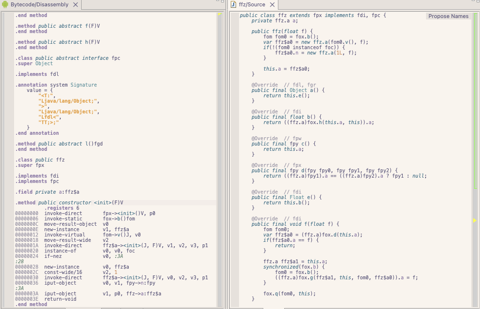
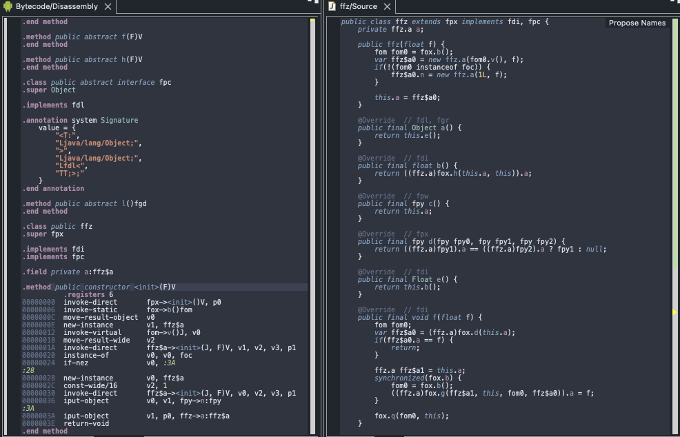
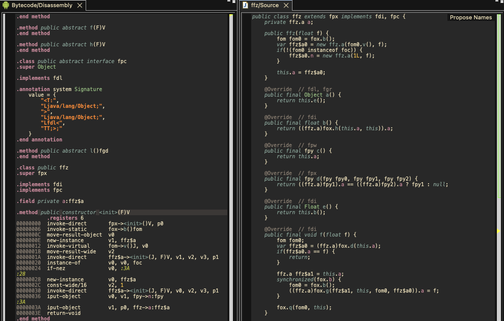
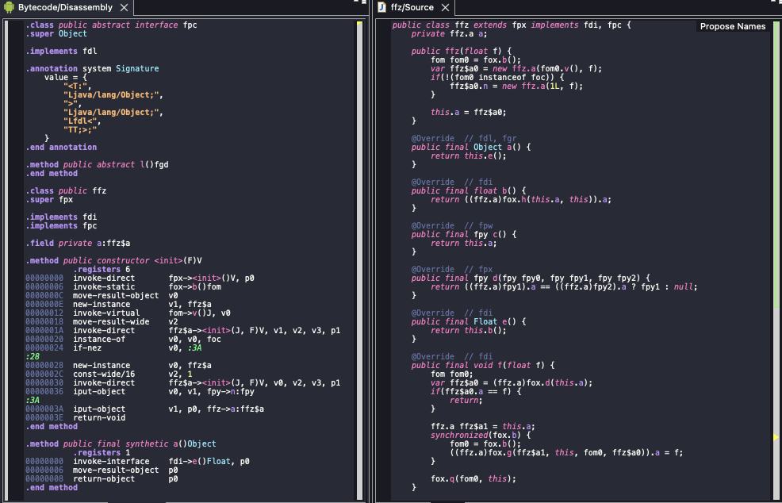

# JEB themes

Hello fellow JEB friends. Have you ever been in the middle of analyzing thousands or obfuscated classes and said to yourself, `If I had a nord theme right now, that would solve all my problems`. Well now you do, 22 themes total!

Theme Internals

JEB theme data comes from two places: `.ui.ColorSchemes` in
`bin/jeb-client.cfg`, and compiled classes in `bin/app/jebc.jar`.
`.ui.ColorSchemes` is a URL-encoded map of `<name>=<body>` entries joined
with `&`. `.ui.ActiveTheme` selects the active entry. Built-in themes often
appear in the config with only metadata because their palette and default
styles come from code.

The built-in definitions live under
`com/pnfsoftware/jeb/rcpclient/themes/` inside `jebc.jar`. `javap -p -c
T_Tomorrow.class` shows the leaf theme classes are almost entirely palette
constructors: they allocate a 13-element `int[]` and fill it with RGB
constants. `T_Template.<init>` maps those slots to `cForeground`,
`cBackground`, `cCurrentLine`, `cSelection`, `cComment`, `cRed`,
`cOrange`, `cYellow`, `cGreen`, `cAqua`, `cBlue`, `cPurple`, and
`cDebugLine`, then expands them into the per-token style table with
`Theme.add(...)` calls. That yields 74 stylable identifiers in total: about
60 explicit rules plus the remaining identifiers inheriting `DEFAULT`.

Serialization is handled by `ThemeManager.encode()`. One theme body is
written as `NAME|DARK|PARENT|FOREGROUND|BACKGROUND|LINE|DEBUGLINE|ACTIVE|...`,
then each styled token is appended as `<CID>=<style>|`, and the outer map is
encoded with `Strings.encodeMap()`. The wire names `LINE` and `ACTIVE` come
from `Theme.lineColor` and `Theme.activeColor`, not the raw palette field
names.

`Style.toString()` serializes one style as `fg,bg,bold,italic,active`.
`javap -v Style.class` shows the concatenation templates are literally
`\u0001\u0001` and `\u0001,`, which explains why empty fields and trailing
commas are preserved. On decode, the parser uses `split(",", -1)` for the
same reason. Colors are formatted by `colorToString()` as upper-case
`RRGGBB` without `#`.

That is enough to reproduce the on-disk format exactly. The JSON files in
this repo model the palette slots, structural colors, and expanded per-token
styles; the build script converts that data back into the `.ui.ColorSchemes`
format accepted by stock JEB.

## Install

1. Build the theme files with `npm run build`, or download a release package from GitHub.
2. Open the `.theme` file you want to install.
3. In `bin/jeb-client.cfg`, append `&<theme-string>` to the existing `.ui.ColorSchemes` value.
4. Start JEB and use the theme selector under `Edit`.

Use `all-themes.theme` if you want to install the full set at once.

## Themes

Light: `ayu-light`, `catppuccin-latte`, `github-light`, `gruvbox-light`, `linen`, `no-tomorrow`, `parchment`, `rose-pine-dawn`, `stone`, `tokyo-night-day`

Dark: `ayu-mirage`, `catppuccin-mocha`, `dracula`, `graphite`, `gruvbox-dark`, `monokai`, `night-owl`, `nord`, `one-dark`, `palenight`, `rose-pine`, `tokyo-night`

## Samples

### rose-pine-dawn

### nord

### gruvbox-dark

### dracula

